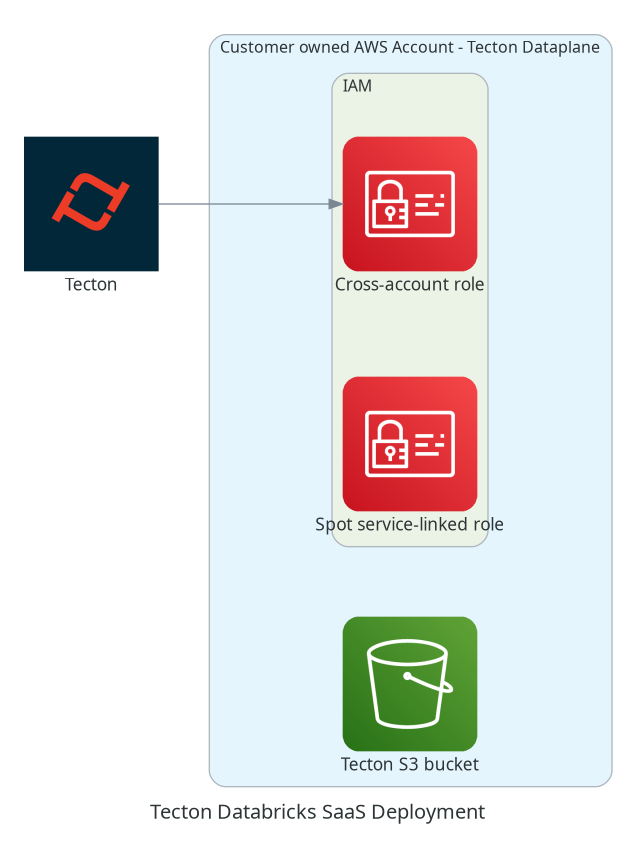

# databricks-saas

## Diagram

<!-- BEGINNING OF PRE-COMMIT-TERRAFORM DOCS HOOK -->
## Requirements

| Name | Version |
|------|---------|
|  [terraform](#requirement\_terraform) | >= 0.13.5 |
|  [aws](#requirement\_aws) | >= 3 |

## Providers

| Name | Version |
|------|---------|
|  [aws](#provider\_aws) | 3.75.2 |

## Modules

| Name | Source | Version |
|------|--------|---------|
|  [common](#module\_common) | ../internal/common | n/a |
|  [iam](#module\_iam) | ../internal/databricks/iam | n/a |

## Resources

| Name | Type |
|------|------|
| [aws_caller_identity.this](https://registry.terraform.io/providers/hashicorp/aws/latest/docs/data-sources/caller_identity) | data source |

## Inputs

| Name | Description | Type | Default | Required |
|------|-------------|------|---------|:--------:|
|  [cross\_account\_assume\_role\_allowed\_ids](#input\_cross\_account\_assume\_role\_allowed\_ids) | A list of AWS account IDs allowed to assume the cross-account role(s). This should be an AWS account ID that is provided by your Tecton rep. | `list(string)` | n/a | yes |
|  [databricks\_workspace](#input\_databricks\_workspace) | The Databricks workspace name not including the full url and not including `cloud.databricks.com`. E.g. `my-workspace.cloud.databricks.com` -> `my-workspace`. | `string` | n/a | yes |
|  [deployment\_name](#input\_deployment\_name) | A unique deployment name. | `string` | n/a | yes |
|  [spark\_role\_name](#input\_spark\_role\_name) | The name of the spark role used for Databricks to attach policies to. | `string` | n/a | yes |
|  [cross\_account\_external\_id](#input\_cross\_account\_external\_id) | A random ID to be associated with the cross-account assume role. This will need to be communicated to your Tecton technical support rep. By default a random ID will be generated if none provided. | `string` | `null` | no |
|  [enable\_elasticache](#input\_enable\_elasticache) | Toggle enabling resources supporting the ElastiCache. | `bool` | `false` | no |
|  [enable\_spot\_service\_linked\_role](#input\_enable\_spot\_service\_linked\_role) | Toggle enabling the spot service linked role. | `bool` | `true` | no |
|  [tags](#input\_tags) | Additional tags to apply to resources. | `map(string)` | `{}` | no |

## Outputs

| Name | Description |
|------|-------------|
|  [cross\_account\_external\_id](#output\_cross\_account\_external\_id) | The external ID to be associated with the cross-account assume role. |
|  [cross\_account\_role\_arn](#output\_cross\_account\_role\_arn) | The ARN of the cross-account IAM role. |
|  [cross\_account\_role\_name](#output\_cross\_account\_role\_name) | The name of the cross-account IAM role. |
|  [databricks\_workspace](#output\_databricks\_workspace) | The Databricks workspace name. |
|  [deployment\_name](#output\_deployment\_name) | The Tecton deployment name. |
|  [region](#output\_region) | The AWS region. |
|  [s3\_bucket](#output\_s3\_bucket) | The Tecton S3 bucket. |
|  [spark\_role\_arn](#output\_spark\_role\_arn) | The ARN of the Spark IAM role. |
|  [spark\_role\_name](#output\_spark\_role\_name) | The name of the Spark IAM role. |
<!-- END OF PRE-COMMIT-TERRAFORM DOCS HOOK -->
