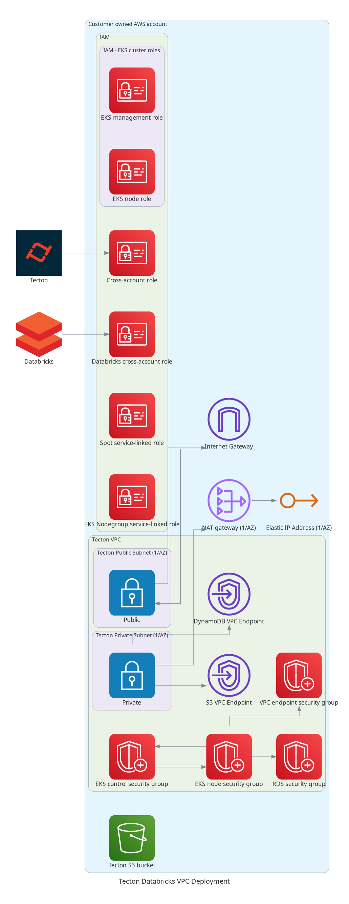

# databricks-vpc

## Diagram

<!-- BEGINNING OF PRE-COMMIT-TERRAFORM DOCS HOOK -->
## Requirements

| Name | Version |
|------|---------|
|  [terraform](#requirement\_terraform) | >= 0.13.5 |
|  [aws](#requirement\_aws) | >= 3 |

## Providers

| Name | Version |
|------|---------|
|  [aws](#provider\_aws) | >= 3 |

## Modules

| Name | Source | Version |
|------|--------|---------|
|  [common](#module\_common) | ../internal/common | n/a |
|  [iam](#module\_iam) | ../internal/databricks/iam | n/a |
|  [network](#module\_network) | ../internal/network | n/a |
|  [security\_groups](#module\_security\_groups) | ../internal/vpc/security_groups | n/a |

## Resources

| Name | Type |
|------|------|
| [aws_caller_identity.this](https://registry.terraform.io/providers/hashicorp/aws/latest/docs/data-sources/caller_identity) | data source |

## Inputs

| Name | Description | Type | Default | Required |
|------|-------------|------|---------|:--------:|
|  [cross\_account\_assume\_role\_allowed\_ids](#input\_cross\_account\_assume\_role\_allowed\_ids) | A list of AWS account IDs allowed to assume the cross-account role(s). This should be an AWS account ID that is provided by your Tecton rep. | `list(string)` | n/a | yes |
|  [databricks\_workspace](#input\_databricks\_workspace) | The Databricks workspace name not including the full url and not including `cloud.databricks.com`. E.g. `my-workspace.cloud.databricks.com` -> `my-workspace`. | `string` | n/a | yes |
|  [deployment\_name](#input\_deployment\_name) | A unique deployment name. | `string` | n/a | yes |
|  [spark\_role\_name](#input\_spark\_role\_name) | The name of the spark role used for Databricks to attach policies to. | `string` | n/a | yes |
|  [availability\_zone\_count](#input\_availability\_zone\_count) | The number of availability zones to deploy in to. If none specified (default), 3 will be used, unless region only has 2 available AZs. Please set this to 3 unless the region being deployed to only has 2 AZs. | `number` | `0` | no |
|  [cross\_account\_external\_id](#input\_cross\_account\_external\_id) | A random ID to be associated with the cross-account assume role. This will need to be communicated to your Tecton technical support rep. By default a random ID will be generated if none provided. | `string` | `null` | no |
|  [dynamodb\_vpc\_endpoint\_id](#input\_dynamodb\_vpc\_endpoint\_id) | Specify the DynamoDB VPC endpoint to route traffic to. If not specified and `enable_dynamodb_vpc_endpoint` is true one will be created. | `string` | `null` | no |
|  [enable\_dynamodb\_vpc\_endpoint](#input\_enable\_dynamodb\_vpc\_endpoint) | Toggle enabling the creation of the DynamoDB VPC endpoint. | `bool` | `true` | no |
|  [enable\_eks\_nodegroup\_service\_linked\_role](#input\_enable\_eks\_nodegroup\_service\_linked\_role) | Toggle enabling the spot service linked role. | `bool` | `true` | no |
|  [enable\_elasticache](#input\_enable\_elasticache) | Toggle enabling resources supporting the ElastiCache. | `bool` | `false` | no |
|  [enable\_ingress\_vpc\_endpoint](#input\_enable\_ingress\_vpc\_endpoint) | Toggle enabling resources supporting the EKS Ingress VPC Endpoint for in-VPC communication. | `bool` | `true` | no |
|  [enable\_s3\_vpc\_endpoint](#input\_enable\_s3\_vpc\_endpoint) | Toggle enabling the creation of the s3 VPC endpoint. | `bool` | `true` | no |
|  [enable\_spot\_service\_linked\_role](#input\_enable\_spot\_service\_linked\_role) | Toggle enabling the spot service linked role. | `bool` | `true` | no |
|  [enable\_vpc\_cidr\_block\_association](#input\_enable\_vpc\_cidr\_block\_association) | Only used when `vpc_id` is specified. Toggle enabling the `aws_vpc_ipv4_cidr_block_association` between the given `vpc_cidr_block` and the VPC specified by `vpc_id`. Should only be disabled if the VPC specified VPC cidr exists and is already associated with the specified VPC. | `bool` | `true` | no |
|  [ingress\_allowed\_cidr\_blocks](#input\_ingress\_allowed\_cidr\_blocks) | CIDR blocks that should be able to access the Tecton cluster. Defaults to `0.0.0.0/0` if none specified. | `list(string)` | `[]` | no |
|  [ingress\_load\_balancer\_public](#input\_ingress\_load\_balancer\_public) | Toggle whether or not the Tecton cluster ingress should be accessible by the public internet and have a public IP address. | `bool` | `true` | no |
|  [nat\_gateways\_by\_az](#input\_nat\_gateways\_by\_az) | Specify existing NAT gateways to be routed to. Input as a mapping of `availability_zone : nat_gateway_id` (example: `{"us-west-2a"= "nat_gateway_a","us-west-2b"= "nat_gateway_b","us-west-2c"= "nat_gateway_c"}`). If none specified, one NAT gateway will be created per availability zone." | `map(string)` | `null` | no |
|  [s3\_vpc\_endpoint\_id](#input\_s3\_vpc\_endpoint\_id) | Specify the S3 VPC endpoint to route traffic to. If not specified and `enable_s3_vpc_endpoint` is true one will be created. | `string` | `null` | no |
|  [tags](#input\_tags) | Additional tags to apply to resources. | `map(string)` | `{}` | no |
|  [vpc\_cidr\_block](#input\_vpc\_cidr\_block) | The VPC cidr block for the private and public subnets which will be created. `vpc_cidr_block` will be associated with the created (or specified) VPC. The smallest acceptable prefix is /18. | `string` | `"10.64.0.0/16"` | no |
|  [vpc\_id](#input\_vpc\_id) | The ID of a pre-existing VPC to deploy the networking resources to. By default (recommended) one will be created if none specified. | `string` | `null` | no |

## Outputs

| Name | Description |
|------|-------------|
|  [cross\_account\_databricks\_tecton\_access\_role\_arn](#output\_cross\_account\_databricks\_tecton\_access\_role\_arn) | The ARN of the Databricks - Tecton access IAM role. |
|  [cross\_account\_databricks\_tecton\_access\_role\_name](#output\_cross\_account\_databricks\_tecton\_access\_role\_name) | The name of the Databricks - Tecton access IAM role. |
|  [cross\_account\_external\_id](#output\_cross\_account\_external\_id) | The external ID to be associated with the cross-account assume role. |
|  [cross\_account\_role\_arn](#output\_cross\_account\_role\_arn) | The ARN of the cross-account IAM role. |
|  [cross\_account\_role\_name](#output\_cross\_account\_role\_name) | The name of the cross-account IAM role. |
|  [databricks\_workspace](#output\_databricks\_workspace) | The Databricks workspace name. |
|  [deployment\_name](#output\_deployment\_name) | The Tecton deployment name. |
|  [dynamodb\_vpc\_endpoint\_id](#output\_dynamodb\_vpc\_endpoint\_id) | The DynamoDB VPC endpoint ID (if enabled). |
|  [eks\_management\_role\_name](#output\_eks\_management\_role\_name) | The name of the EKS management IAM role. |
|  [eks\_node\_role\_name](#output\_eks\_node\_role\_name) | The name of the EKS node IAM role. |
|  [ingress\_vpc\_endpoint\_security\_group\_id](#output\_ingress\_vpc\_endpoint\_security\_group\_id) | If deployment\_type is vpc, the ID of the ingress VPC endpoint. |
|  [nat\_gateway\_ips](#output\_nat\_gateway\_ips) | The IDs of the NAT gateway public IPs. |
|  [private\_subnet\_ids](#output\_private\_subnet\_ids) | The IDs of the private subnets. |
|  [private\_subnet\_route\_table\_ids](#output\_private\_subnet\_route\_table\_ids) | The IDs of the private subnet route tables. |
|  [public\_subnet\_ids](#output\_public\_subnet\_ids) | The IDs of the public subnets. |
|  [public\_subnet\_route\_table\_ids](#output\_public\_subnet\_route\_table\_ids) | The IDs of the public subnet route tables. |
|  [region](#output\_region) | The AWS region. |
|  [roles](#output\_roles) | A mapping of the IAM roles. |
|  [s3\_bucket](#output\_s3\_bucket) | The Tecton S3 bucket. |
|  [s3\_vpc\_endpoint\_id](#output\_s3\_vpc\_endpoint\_id) | The S3 VPC endpoint ID (if enabled). |
|  [security\_group\_ids](#output\_security\_group\_ids) | A map of the security group IDs. |
|  [spark\_role\_arn](#output\_spark\_role\_arn) | The ARN of the Spark IAM role. |
|  [spark\_role\_name](#output\_spark\_role\_name) | The name of the Spark IAM role. |
|  [vpc\_cidr\_block](#output\_vpc\_cidr\_block) | The CIDR block associated with the VPC. |
|  [vpc\_id](#output\_vpc\_id) | The ID of the VPC. |
<!-- END OF PRE-COMMIT-TERRAFORM DOCS HOOK -->
